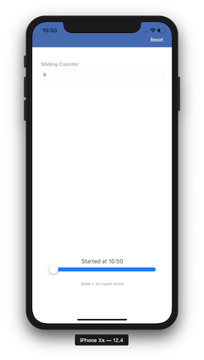

    

## The Goal 
Building a simple counter using UISlider

---

## Features 
* Counting using Slider ✅
    
    Slide to the right and to the left will increase the value of the counter

* Persistent data ✅
    
    Close the app, and when you reopen it, the last value of the counter and the position of the slider is still there!

* Available on all iPhone ✅

---
Odji Chrissy 📩[satyananda.chrissy@gmail.com](mailto:satyananda.chrissy@gmail.com)

[Linkedin](www.linkedin.com/in/chrissysatyananda) | [Github](https://github.com/odjichrissy)
